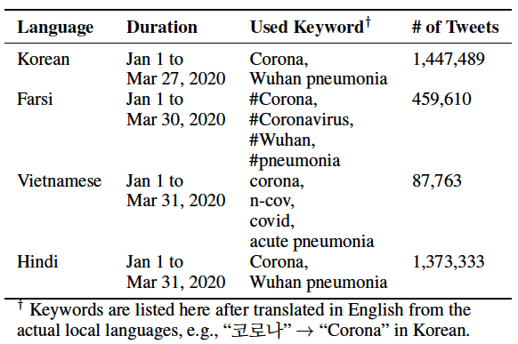
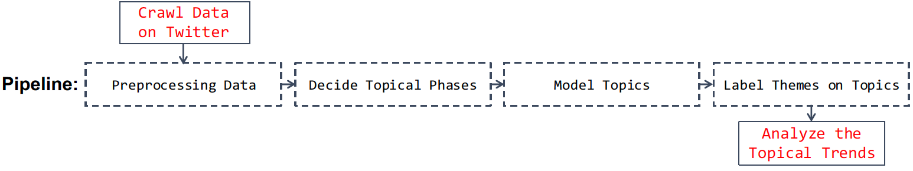

# Risk Communication in Asian Countries: <br> COVID-19 Discourse on Twitter
Implementation details including codes in Python. You can find the orignal paper "Risk Communication in Asian Countries: COVID-19 Discourse on Twitter" at the following link: https://arxiv.org/abs/2006.12218.

##### Please cite as:
Park S, Han S, Kim J, Molaie MM, Vu HD, Singh K, Han J, Lee W, and Cha M <br>
Risk Communication in Asian Countries: COVID-19 Discourse on Twitter <br>
arXiv preprint arXiv:2020.XXXX, 2020. <br>


### Data
#### 1. The Raw Dataset
We have crawled the Twitter dataset by using the existing Twint Python library and Twitter search APIs. The Twint Python library is an advance twitter scraping tool, written in Python. The detailed information about the scraper is explained at https://github.com/twintproject/twint.

Plese refer to the below code snippet to find an example usage case:
- "./code/code_tweet_collection.pdf"

Should you wish to get the raw dataset that we have crawled, please directly contact the author via shaun.park@kaist.ac.kr for a detailed instruction.

#### 2. Data Description
The below table is the statistics of the crawled tweets.



In particular, we have set up the following keywords/hashtags by country to crawl tweets related to COVID-19.

```
[South Korea]
- corona: 코로나
- wuhan pneumonia: 우한 폐렴

[Iran]
- corona: #کرونا
- coronavirus: #کروناویروس
- wuhan: #ووهان
- pneumonia: #سینه‌پهلو

[Vietnam]
- corona
- n-cov
- covid
- acute pneumonia: viêm phổi cấp

[India]
- corona: कोरोना
- wuhan pneumonia: वूहान निमोनिया
```

Also, Below are the column names (features) and the corresponding descriptions of the dataset:

```
- id (type == int64): The integer representation of the unique identifier for this Tweet
- conversation_id (int64): The Tweet ID of the conversation tree’s root
- created_at (datetime64): UTC time when this Tweet was created
- date (datetime64): UTC time formatted YYYY-MM-DD
- time (object): UTC time formatted h:m:s
- timezone (object): Timezone
- user_id (int64): The integer representation of the unique identifier for this User
- username (object): The screen name, handle, or alias that this user identifies themselves with
- name (object): The name of the user, as they’ve defined it
- place (object): Nullable When present, indicates that the tweet is associated (but not necessarily originating from) a Place
- tweet (object): The actual UTF-8 text of the status update
- mentions (object): Represents other Twitter users mentioned in the text of the Tweet
- urls (object): Represents URLs included in the text of a Tweet
- photos (object): Represents photo elements uploaded with the Tweet
- replies_count (int64): Number of times this Tweet has been replied to
- retweets_count (int64): Number of times this Tweet has been retweeted
- likes_count (int64): Nullable. Indicates approximately how many times this Tweet has been liked by Twitter users
- hashtags (object): Represents hashtags which have been parsed out of the Tweet text
- video (int64): The number of video elements uploaded with the Tweet
- geo (object): Nullable. Represents the geographic location of this Tweet as reported by the user or client application
- source (object): Utility used to post the Tweet, as an HTML-formatted string
- reply_to (object): Reply infos containing user_id and username
```

Deprecated Attributes:

```
- cashtags (object)
- quote_url (object)
- near (object)
- retweet (bool)
- user_rt_id (object) 
- user_rt (object)
- retweet_id (object) 
- retweet_date (object) 
- translate (object) 
- trans_src (object)
- trans_dest (object)
```


### Pipeline
Please refer to the manuscript to find the detailed explanations for the below four modules.



```
[Required Basic Packages]
The code has been tested running under Python 3.6.6. with the following packages installed (along with their dependencies):
- numpy == 1.16.0
- pandas == 0.23.4
```

#### 1. Pre-processing Data
For the detailed tweet pre-processing and tokenizing process, please refer to the below file including code snippet and correponding explanation:
- "./code/code_text_preprocessing_tokenization.pdf"

```
[South Korea]
We have used the below Korean-specific stopwords and tokenizers.
- pre-processing
  - text cleaning: removed special characters and URLs  
  - stopwords: find "./code/korean_stopwords.txt"
- tokenizing: utilized the MeCab-Ko tokenizer (http://eunjeon.blogspot.com/)
- Please refer to the following code snippet file to find an example usage case: "./code/code_Korean_tokenize_sentences.pdf"

[Iran]
We have used the below Farsi-specific stopwords and tokenizers.
- pre-processing
  - text cleaning: removed special characters and URLs
  - stopwords: find "./code/farsi_stopwords.txt"
- tokenizing: utilized the Parsivar tokenizer (https://github.com/ICTRC/Parsivar)
- Please refer to the following code snippet file to find an example usage case: "./code/code_Persian_tokenize_sentences.py"

[Vietnam]
We have used the below Vietnamese-specific stopwords and tokenizers.
- pre-processing
  - text cleaning: removed special characters and URLs  
  - stopwords: find "./code/vietnamese_stopwords.txt"
- tokenizing: utilized the Pyvi tokenizer (https://github.com/trungtv/pyvi)
- Please refer to the following code snippet file to find an example usage case: "./code/code_Vietnamese_tokenize_sentences.pdf"

[India]
We have used the below Hindi-specific stopwords and tokenizers.
- pre-processing
  - text cleaning: removed special characters, non-Hindi characters/words, and URLs
  - stopwords: find "./code/hindi_stopwords.txt"
- tokenizing: utilized word-level morphemes as tokens
```

#### 2. Decide Topical Phases
For spliting topical phases, plese refer to the below code snippet:
- "./code/code_split_phases.pdf"

For deciding the phases, plese refer to the below code snippet:
- "./code/code_decide_topical_phases.pdf"

#### 3. Model Topics
We have used the Tomotopy module (https://bab2min.github.io/tomotopy/v0.6.2/en/). Please refer to the below code snippet to find an example usage case:
- "./code/code_topic_modeling.pdf" <br> <br>


Should you have any questions or comments, please contact us at the following email address: shaun.park@kaist.ac.kr. <br> <br>


< end of document >
