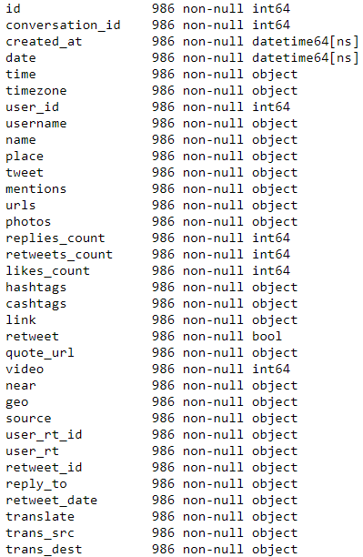

# Risk Communication in Asian Countries: COVID-19 Discourse on Twitter
Implementation details including codes in Python. You can find the orignal paper "Risk Communication in Asian Countries: COVID-19 Discourse on Twitter" at the following link: http://arxiv.org/xxxx.

##### Please cite as:
Park S, Han S, Kim J, Molaie MM, Vu HD, Singh K, Han J, Lee W, Cha M <br>
Risk Communication in Asian Countries: COVID-19 Discourse on Twitter <br>
arXiv preprint arXiv:2020.XXXX, 2020. <br>


### Data
#### The raw dataset
We have crawled the Twitter dataset by using the existing Twint Python library and Twitter search APIs. The Twint Python library is an advance twitter scraping tool, written in Python. The detailed information about the scraper is explained at https://github.com/twintproject/twint.

Should you wish to get the raw dataset, please directly email to shaun.park@kaist.ac.kr for a detailed instruction. Below are the column names of the dataset:




### Pipeline
Please refer to the manuscript to find the detailed explanations for the below four modules.


```
#### Required Packages
The code has been tested running under Python 3.6.6. with the following packages installed (along with their dependencies):
- numpy == 1.16.0
- pandas == 0.23.4
```

#### 1. Pre-processing Data
For tweet pre-processing and tokenizing, please refer to the below files:
- code snippet and explanation

##### South Korea
We have used the below Korean-specific stopwords and tokenizers.
- pre-processing: find "./code/korean_stopwords.txt"
- tokenizing: utilized the MeCab-Ko tokenizer (http://eunjeon.blogspot.com/)

##### Iran
We have used the below Farsi-specific stopwords and tokenizers.
- pre-processing: find "./code/farsi_stopwords.txt"
- tokenizing: utilized the 

##### Vietnam
We have used the below Vietnamese-specific stopwords and tokenizers.
- pre-processing: find "./code/vietnamese_stopwords.txt"
- tokenizing: utilized the 

##### India
We have used the below Hindi-specific stopwords and tokenizers.
- pre-processing: find "./code/hindi_stopwords.txt"
- tokenizing: utilized the 


#### 2. Decide Topical Phases
For 


#### 3. Model Topics


#
##
###
#### The latent variables via CAE dataset
Another one ("Saved_latent.csv") is for providing the latent variables extracted via Covolutional Autoencoder (CAE). The latent variables were the result of minimizing L2-norm regularized reconstruction loss (L) between the original image (𝑦) and the reconstructed image (𝑦^) for 1,470 images (𝑛 = 1470) on the CAE (see the below formular for the loss function).


The features included in the dataset are as follows.

### Required packages
The code has been tested running under Python 3.6.6. with the following packages installed (along with their dependencies):

- numpy == 1.16.0
- pandas == 0.23.4
- tensorflow == 1.12.0
- scikit-learn == 0.20.2


### Code
We provide codes from Step 1 to Step 3 on the “Clustering Steps” section at the manuscript. Based on the codes, it is possible to imagify the given original data then to extract latent variables via CAE. For the remaining Step 4 and Step 5, we have not included the
corresponding codes since we also use the open sources of t-SNE and various conventional clustering methods.

#### How to Run
```
1. Setting the path of the model codes in main.ipynb.
   (i.e., The location of the two model codes "/models/layers.py" and "/models/model.py", constructing the intenal layers of the CAE model and composing the structure of the CAE, respectively, can be set as "models" in main.ipynb)
2. python main.ipynb -- After you finish the first step, you can execute main.ipynb and get latent variables and the related visualization (see the below example result).
``` 

#### Step 1: Preprocessing of Time-Series Data & Step 2: Composing Sequential Images From Data
By runnung the code, we can convert the consecutive daily data into a image; one image is composed of the 8 consecutive daily vectors with 96 dimensions (8 days × 12 features). The imagifying process follows the below figure.


#### Step 3: Learning Representations With Reducing Dimensions via Convolutional Autoencoder
By runnning the code ("main.ipynb"), it is possible to extract the latent variables of the CAE as presented at the dataset "Saved_latent.csv." The interal structure of the CAE is as follows. Based on our learning, the optimal number of the latent variables has been found as 15 (i.e., 15 dimensions). In fact, We tested all combinations among 5 hyperparameters (i.e., grid search) and found that the optimal values were 1e^–4 with the AdamOptimizer (optimal learning rate); 0.75 (optimal γ value); 3 (optimal vertical size); 30 (number of convolutional filters); and 15 (number of latent variables), for each of these hyperparameters with the lowest L2-norm regularized reconstruction loss value of 1.09.


##### Example Result
By running the main.ipynb, you can visualize the quality of the learning results on the CAE model. The below Figure depicts the 35 input images and 35 reconstructed outputs of one random participant. This visual coherence ensures that the CAE efficiently reduced
the input size dimensions (ie, 8×12 → 15) by learning the vital latent representations of the data.


Should you have any questions or comments, please contact us at the following email address: shaun.park@kaist.ac.kr.
